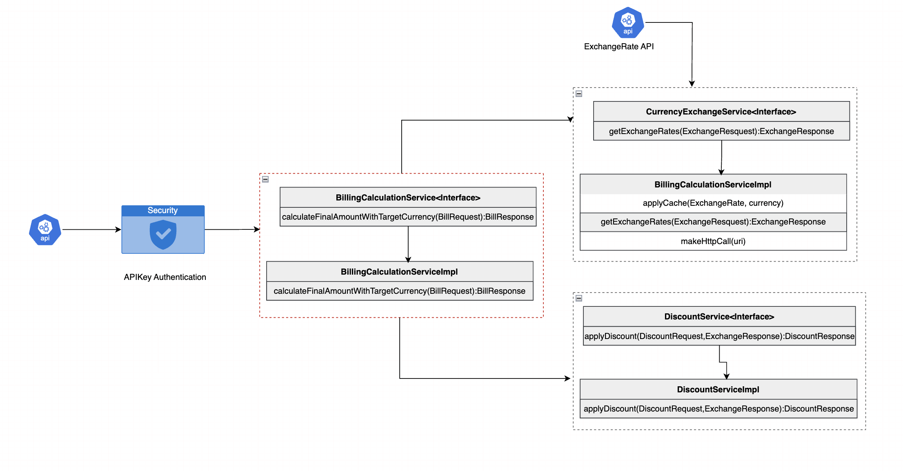

# Currency Exchange and Discount Calculation

## Description
A Spring Boot application that integrates with a third-party currency exchange API to retrieve real-time exchange rates. The application should calculate the total payable amount for a bill in a specified currency after applying applicable discounts.

## Currency Exchange LLD



### 1. Third-Party API Integration
- Integrate with **ExchangeRate-API** or **Open Exchange Rates** to get real-time exchange rates.
- Example API URL:
  ```
  https://v6.exchangerate-api.com/v6/{api_key}/latest/{base_currency}
  ```
### 2. API Endpoint
#### **POST /api/calculate**
**Request Body:**
```json
{
  "items": [
    {
      "name": "Laptop",
      "price": 1000.00,
      "grocery": false
    },
    {
      "name": "Milk",
      "price": 50.00,
      "grocery": true
    },
    {
      "name": "Headphones",
      "price": 200.00,
      "grocery": false
    }
  ],
  "originalCurrency": "EUR",
  "targetCurrency": "INR",
  "user": {
    "userType": "EMPLOYEE",
    "tenureInYears": 3
  }
}

```
**Response:**
```json
{
  "originalBillAmount": 1250,
  "finalCost": 80758.11433,
  "originalCurrency": "EUR",
  "targetCurrency": "INR"
}
```

## Setup Instructions
### Prerequisites
- Java 17, Spring Boot, Maven, API key.

### Git Repo
1. **Repository:**
   ```bash
    https://github.com/Anudharshini/currency-exchange.git
   ```
2. **Run the application:**
   ```bash
   mvn clean install
   mvn spring-boot:run
   ```
3. **API available at:** `http://localhost:8080/api/calculate`
4. **Sonar Intergrated:** Actions Tab

## Author
Anu Dharshini B
